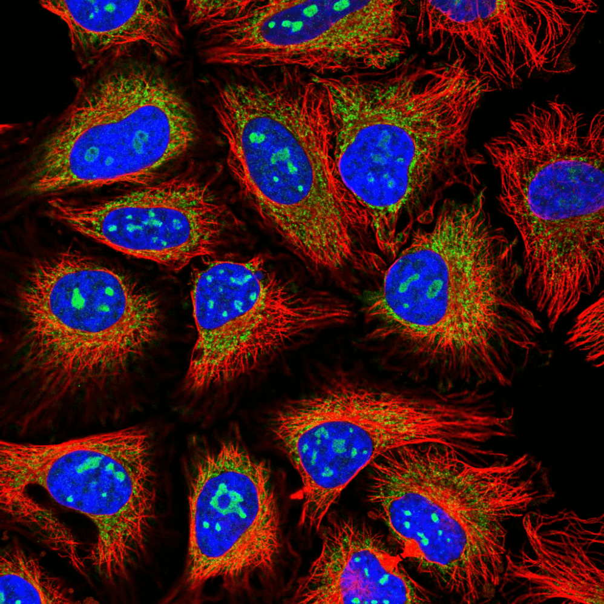

# Human Protein Atlas Image classification
Classify subcellular protein patterns in human cells

This is a project for the [Human Protein Atlas Image Classification](https://www.kaggle.com/c/human-protein-atlas-image-classification) competition on Kaggle.

## Introduction

Human Protein Atlas Image Classification is a task that involves categorizing and labeling images of proteins based on their presence or absence in cells, tissues, and organs. The Human Protein Atlas project aims to map and understand the expression and localization of proteins in the human body.

Image classification in the Human Protein Atlas typically involves using machine learning techniques to analyze and interpret images obtained through various imaging techniques, such as immunohistochemistry and fluorescent microscopy. The goal is to accurately identify and classify the proteins present in the images.

This task is challenging due to the complexity and variability of protein expression patterns across different tissues and cell types. It requires the development of robust algorithms and models that can effectively recognize and classify proteins based on visual features and patterns in the images.

The Human Protein Atlas provides a valuable resource for researchers and scientists studying protein expression and function in human biology and disease. The image classification efforts contribute to the comprehensive understanding of the human proteome and its implications in various biological processes and diseases.

## Data

## Model

## Results