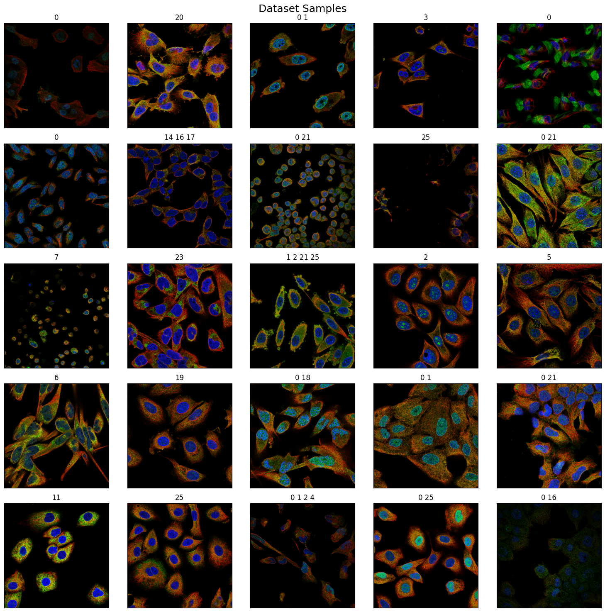

# Human Protein Atlas Image classification
Classify subcellular protein patterns in human cells

This is a project for the [Human Protein Atlas Image Classification](https://www.kaggle.com/c/human-protein-atlas-image-classification) competition on Kaggle.

## Introduction

Human Protein Atlas Image Classification is a task that involves categorizing and labeling images of proteins based on their presence or absence in cells, tissues, and organs. The Human Protein Atlas project aims to map and understand the expression and localization of proteins in the human body.

Image classification in the Human Protein Atlas typically involves using machine learning techniques to analyze and interpret images obtained through various imaging techniques, such as immunohistochemistry and fluorescent microscopy. The goal is to accurately identify and classify the proteins present in the images.

This task is challenging due to the complexity and variability of protein expression patterns across different tissues and cell types. It requires the development of robust algorithms and models that can effectively recognize and classify proteins based on visual features and patterns in the images.

The Human Protein Atlas provides a valuable resource for researchers and scientists studying protein expression and function in human biology and disease. The image classification efforts contribute to the comprehensive understanding of the human proteome and its implications in various biological processes and diseases.

## Data

The data is available in two versions of the same images (512x512 PNG files and a mix of 2048x2048 and 3072x3072 TIFF files) on Kaggle. In this projectt, the PNG files are used. There are train.zip, test.zip, train.csv and sample_submission.csv.
The goal is predicting protein organelle localization labels for each sample. There are in total 28 different labels present in the dataset. The dataset is acquired in a highly standardized way using one imaging modality (confocal microscopy). However, the dataset comprises 27 different cell types of highly different morphology, which affect the protein patterns of the different organelles. All image samples are represented by four filters (stored as individual files), the protein of interest (green) plus three cellular landmarks: nucleus (blue), microtubules (red), endoplasmic reticulum (yellow). The green filter should hence be used to predict the label, and the other filters are used as references.

#### The labels are represented as integers that map to the following:

0.  Nucleoplasm  
1.  Nuclear membrane   
2.  Nucleoli   
3.  Nucleoli fibrillar center   
4.  Nuclear speckles   
5.  Nuclear bodies   
6.  Endoplasmic reticulum   
7.  Golgi apparatus   
8.  Peroxisomes   
9.  Endosomes   
10.  Lysosomes   
11.  Intermediate filaments   
12.  Actin filaments   
13.  Focal adhesion sites   
14.  Microtubules   
15.  Microtubule ends   
16.  Cytokinetic bridge   
17.  Mitotic spindle   
18.  Microtubule organizing center   
19.  Centrosome   
20.  Lipid droplets   
21.  Plasma membrane   
22.  Cell junctions   
23.  Mitochondria   
24.  Aggresome   
25.  Cytosol   
26.  Cytoplasmic bodies   
27.  Rods & rings
    
#### File descriptions:
train.csv:  filenames and labels for the training set.\
sample_submission.csv:  filenames for the test set, and a guide to constructing a working submission.\
train.zip:  All images for the training set\
test.zip:  All images for the test set.

#### Data fields:
Id - the base filename of the sample. As noted above all samples consist of four files - blue, green, red, and yellow.\
Target - in the training data, this represents the labels assigned to each sample.

## Model

## Results
